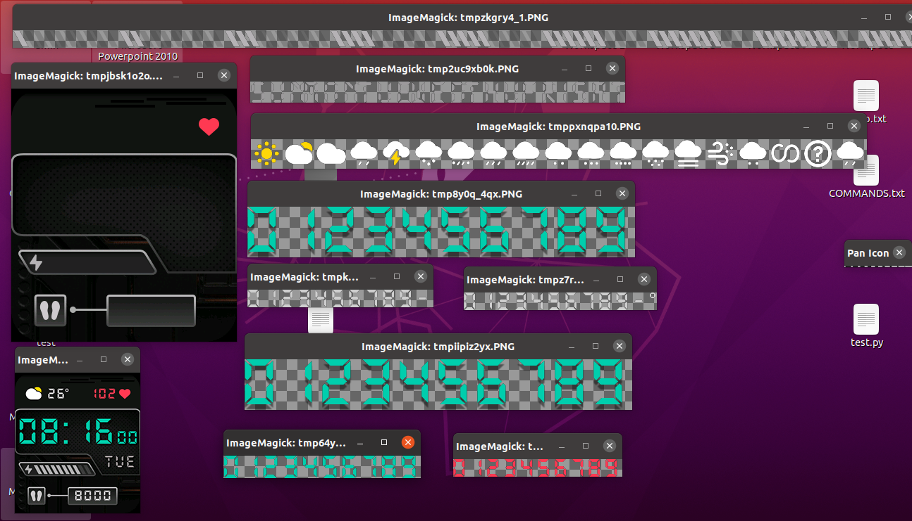

# miwtool
A tool for manipulating Redmi Watch 2 Lite watchface files

-----
## Installation
- Clone this repository and unzip it
- Make sure that you have python (3.8 +) installed
- Install requirements:
```commandline
pip install -r requirements.txt
```

-----
## Usage
- Unpacking
```
main.py --decode /path/to/input --output /path/to/output
```

- Repacking
```
main.py --encode /path/to/input --output /path/to/output
```

------
##  Watch Faces extraction
To extract watch faces, you need to install Mi Fitness on an android 
device, download a watchface, and then navigate to 
```
Android/data/$PACKAGE_NAME/files/WatchFace
```
(`$PACKAGE_NAME` might be `com.mi.health` 
or `com.xiaomi.wearable` depending on your region)

------

## Unpacked folder tree
```commandline
.
├── config.json
├── images_0
│   └── static.png
...
├── images_11
│   ├── image_0.png
│   ├── image_1.png
...
│   ├── image_8.png
│   └── image_9.png
└── images_preview
    └── static.png
```

### config.json structure
```
{
    "name": "Watch Face Name",
    "id": "12345678",
    "preview": {
        "static": "path/to/preview.png"
    },
    "components": [
        {
            "x": 0,
            "y": 0,
            "static": "background.png"
        },
        ...
        ]
    }
}
```

### Component attributes

| Attribute           | Condition       | Description                                      | Data type     |
|---------------------|-----------------|--------------------------------------------------|---------------|
| x                   | *               | x coordinate                                     | int16         |
| y                   | *               | y coordinate                                     | int16         |
| static              | optional        | static image path                                | string        |
| dynamic             | optional        | dynamic images paths                             | array[string] |
| type                | optional        | defines the type of a dynamic widget             | object        |
| -- category         | *               | [TIME / BATTERY...]                              | string        |
| -- type             | *               | [HOUR / TEMPERATURE / ...]                       | string        |
| -- format           | *               | the format to display  the data                  | string        |
| -- coordinate_types | *               | what x and y mean                                | string        |
| pivot_x             | if R            | xcenter of rotation                              | int16         |
| pivot_y             | if R            | ycenter of rotation                              | int16         |
| max_value           | if R            | max_value that defines a rotation                | int16         |
| max_degrees         | if R            | degrees corresponding to max_value (3600° is 2π) | int16         |
| values_ranges       | if FORMAT_IMAGE | value range for each image                       | array[uint32] |

### Notes
- Images can have any names and can be placed in any folder
- All categories, types, formats, and coordinate_types can be found in `constants.py`


-----
# Example

